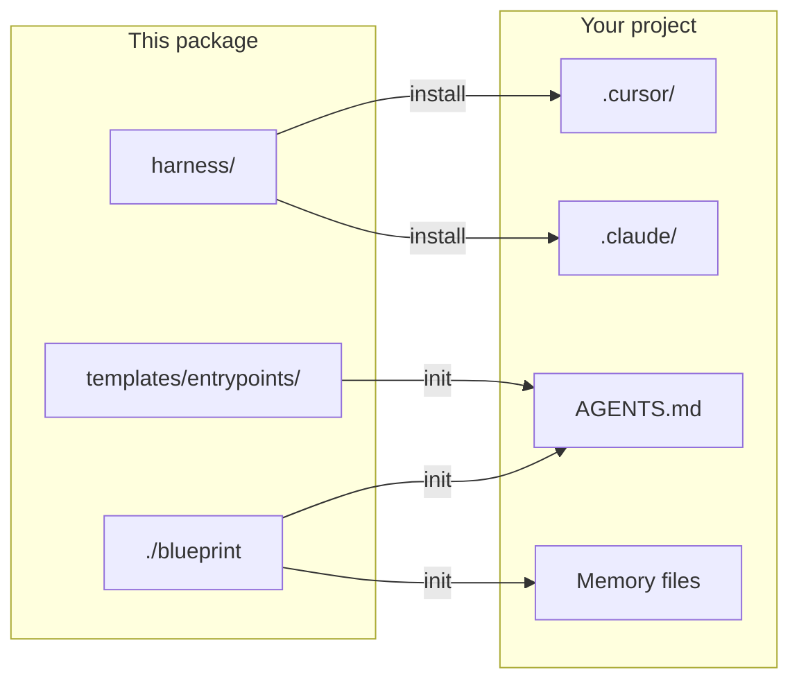
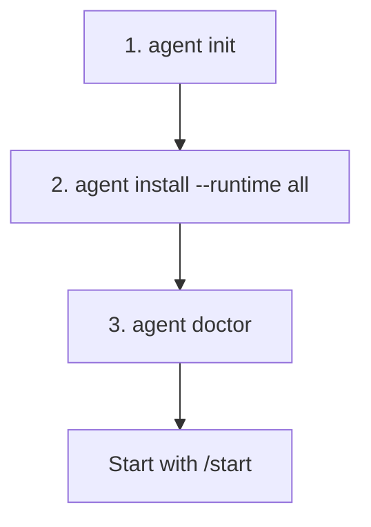
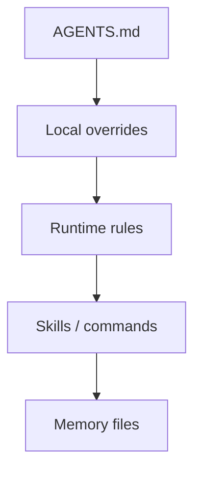
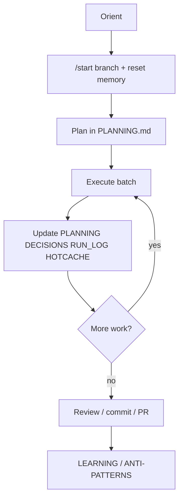

# Shared Agent Blueprints

Team harness for **Cursor**, **Claude Code**, and any agent that honors `AGENTS.md`.

This repo is the **package source**. Adopting projects run `init` → `install` before product work. Live `.cursor/` / `.claude/` trees and task memory files belong in consumers only.

---

## Contents

1. [Architecture](#1-architecture)
2. [Setup blueprint](#2-setup-blueprint)
3. [How it works](#3-how-it-works)
4. [Harness workflow](#4-harness-workflow)
5. [Docs index](#5-docs-index)

---

## 1. Architecture

Canonical content lives under `harness/`. Tool runtimes are projections. `AGENTS.md` is the shared contract every agent reads.



| Concept | Detail |
|---|---|
| Package | `harness/`, `blueprints/`, `templates/`, `./blueprint` |
| Consumer contract | `AGENTS.md` (+ thin `CLAUDE.md`) |
| Runtimes | `.cursor/` and/or `.claude/` from `--runtime` |

Full diagrams: **[docs/architecture.md](docs/architecture.md)** · compatibility: **[docs/compatibility.md](docs/compatibility.md)**

---

## 2. Setup blueprint

Every project should install this kit before coding.



```bash
# Interactive menu (TTY)
./blueprint
./blueprint menu --target /path/to/your-repo

./blueprint doctor
./blueprint init --target /path/to/your-repo
./blueprint install default --runtime all --target /path/to/your-repo
# optional:
# ./blueprint install engineering --overlay gitlab --runtime all --target /path/to/your-repo
```

| Step | Result |
|---|---|
| `init` | `AGENTS.md`, `CLAUDE.md`, memory skeletons, managed `.gitignore` — **no** tool runtime yet |
| `install` | Projects commands/rules/skills into `.cursor/` and/or `.claude/` (prompts for runtime if `--runtime` omitted) |
| `--runtime` | `cursor` \| `claude` \| `all` — both tools optional; omit for interactive selector |

| Blueprint | Use when |
|---|---|
| `default` | Any repo — start/review, safety, core skills |
| `engineering` | Commit/refactor/ADR workflows |
| `startup` | PRD/ADR-heavy early product work |

Step-by-step + checklist: **[docs/setup.md](docs/setup.md)** · **[docs/adoption-and-lineage.md](docs/adoption-and-lineage.md)**

---

## 3. How it works

Agents orient from `AGENTS.md`, then rules/skills under the active runtime, then memory when executing planned work.



| Layer | Role |
|---|---|
| Commands | Playbooks: `/start`, `/review`, `/commit`, forge overlays |
| Rules | Always-on or path-scoped policy |
| Skills | Multi-step procedures (`SKILL.md` + templates) |
| Memory | Cross-session planning, decisions, telemetry |

`install` / `sync` never overwrite existing memory state; unmanaged files get `*.blueprint-conflict` siblings instead of silent overwrite.

Projection & conflict policy: **[docs/how-it-works.md](docs/how-it-works.md)** · skills/rules/commands: **[docs/skills.md](docs/skills.md)** · **[docs/rules.md](docs/rules.md)** · **[docs/slash-commands.md](docs/slash-commands.md)**

---

## 4. Harness workflow

Delivery loop after install:



1. **Orient** — read contract + overrides + relevant skills  
2. **`/start`** — feature/hotfix branch; reset task-scoped memory templates  
3. **Plan** — keep `PLANNING.md` truthful  
4. **Execute** — implement one batch  
5. **Update memory** — planning, decisions, telemetry, hotcache together  
6. **Ship** — `/review`, `/commit`, forge commands when installed  
7. **Learn** — draft in `LEARNING.md`; promote only after human review  

Full walkthrough: **[docs/harness-workflow.md](docs/harness-workflow.md)** · `/start`: **[docs/quick-start.md](docs/quick-start.md)** · memory: **[docs/memory-and-planning.md](docs/memory-and-planning.md)**

---

## 5. Docs index

| Category | Doc |
|---|---|
| Architecture | [architecture.md](docs/architecture.md), [compatibility.md](docs/compatibility.md) |
| Setup | [setup.md](docs/setup.md), [adoption-and-lineage.md](docs/adoption-and-lineage.md) |
| How it works | [how-it-works.md](docs/how-it-works.md), [skills.md](docs/skills.md), [rules.md](docs/rules.md), [slash-commands.md](docs/slash-commands.md) |
| Workflow | [harness-workflow.md](docs/harness-workflow.md), [quick-start.md](docs/quick-start.md), [memory-and-planning.md](docs/memory-and-planning.md) |
| Index | [docs/README.md](docs/README.md) |

### Package layout

```
.
├── harness/             # canonical commands, rules, skills
├── blueprints/          # default | engineering | startup
├── templates/           # entrypoints + memory + PRD/ADR
├── prompts/             # prompt library
├── docs/                # diagrams + deep docs
├── blueprint            # CLI: init | install | sync | doctor | menu
└── examples/consumer/   # example consumer install state
```
