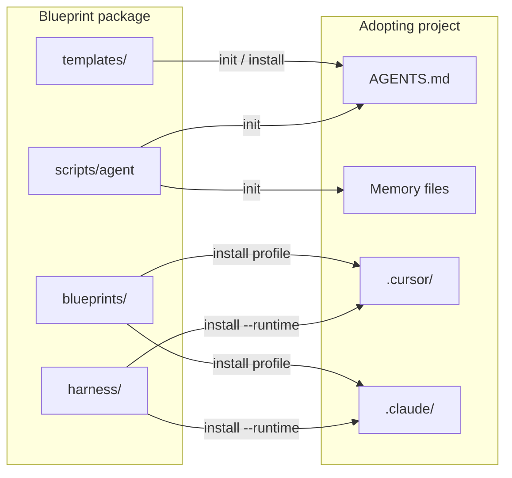
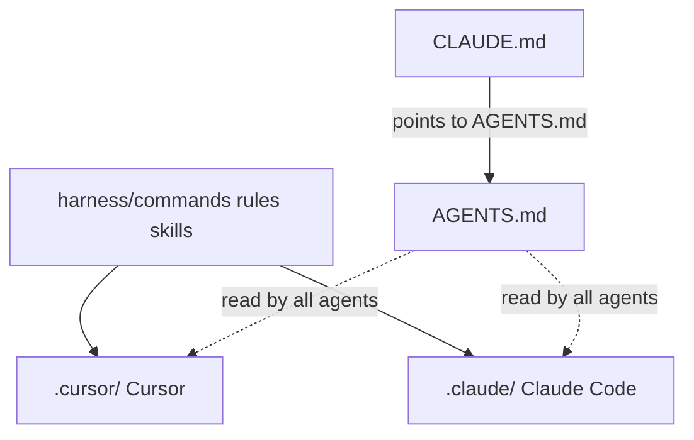

# Architecture

How the blueprint package relates to consuming projects and AI tools.

## Package vs consumer

## Source of truth

| Layer | Lives in package | Lands in consumer |
|---|---|---|
| Commands / rules / skills | `harness/` | `.cursor/` and/or `.claude/` |
| Shared AI contract | `templates/entrypoints/` | `AGENTS.md`, `CLAUDE.md` |
| Memory skeletons | `templates/memory/` | `PLANNING.md`, … (once; never overwritten) |
| Profiles | `blueprints/` | Selected extras + overlays |

Canonical content is always edited under `harness/` (and templates), then projected with `install` / `sync`. Tool dirs are adapters, not forks.

## Multi-runtime projection

| Source | Cursor | Claude Code |
|---|---|---|
| `harness/commands/*.md` | `.cursor/commands/` | `.claude/commands/` |
| `harness/skills/*/` | `.cursor/skills/` | `.claude/skills/` |
| `harness/rules/*.mdc` | `.cursor/rules/*.mdc` | `.claude/rules/*.md` |
| Workflow templates (`adr`, `prd`, …) | `.cursor/templates/` | `.claude/templates/` |

See also [compatibility.md](compatibility.md).
