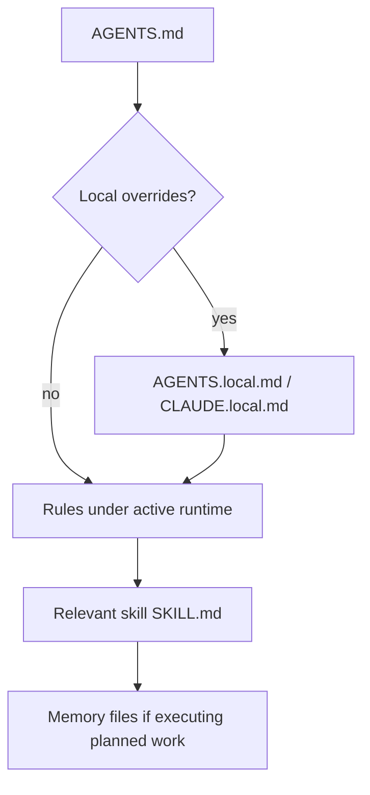
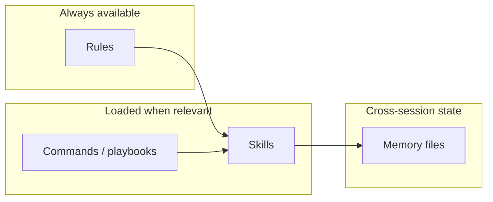
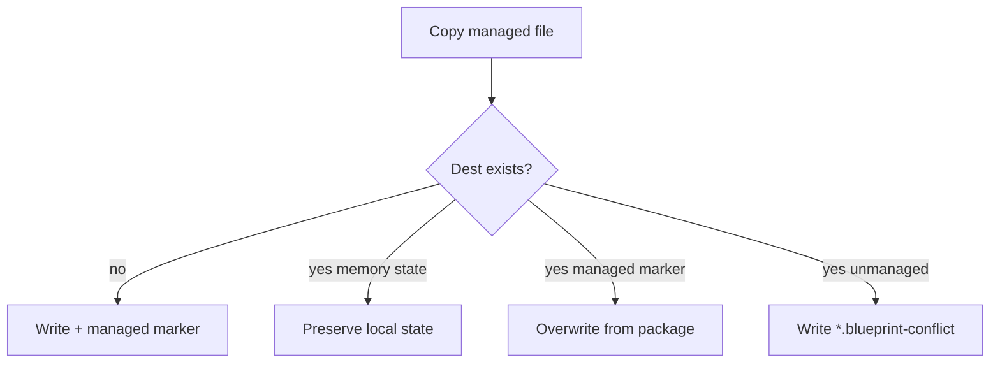

# How it works

Runtime behavior after a project has been initialized and installed.

## Read order (any agent)

Claude Code also loads root `CLAUDE.md`, which points at `AGENTS.md` first.

## Layers

| Layer | Role | Typical path |
|---|---|---|
| **Commands** | Named playbooks (`/start`, `/review`, `/commit`, forge) | `<runtime>/commands/` |
| **Rules** | Always-on or path-scoped policy | `<runtime>/rules/` |
| **Skills** | Curated multi-step procedures | `<runtime>/skills/*/SKILL.md` |
| **Memory** | Planning, decisions, telemetry, scratch | Repo root `*.md` |

`<runtime>` is `.cursor` or `.claude`.

## Install / sync conflict policy

Local overrides (`*.local.md`, `*.local.mdc`, `.agent-blueprint.local.yaml`) always win.

## Update loop

1. Edit package sources under `harness/` / `templates/` / `blueprints/`.
2. In the consumer: `./blueprint sync --dry-run`, review, then `sync`.
3. Run `./blueprint doctor --target .`.

When consumer state `source` is a git URL, `sync` / `install` fetch or update a local cache (`$XDG_CACHE_HOME/blueprint/repos/`) before copying. Status symbols (`→` `✓` `!` `✗` `⊘` `~` `+`) stream per file; a final summary reports added / updated / skipped / failed counts and a run ID.

Interrupted operations leave `.agent-blueprint/session.json` in the consumer. The next interactive `install` / `sync` offers resume; non-interactive runs start fresh unless `BLUEPRINT_RESUME=1`.

Details: [compatibility.md](compatibility.md), [slash-commands.md](slash-commands.md), [rules.md](rules.md), [skills.md](skills.md).
