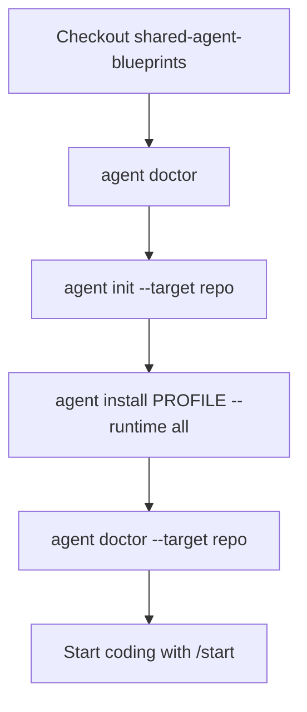
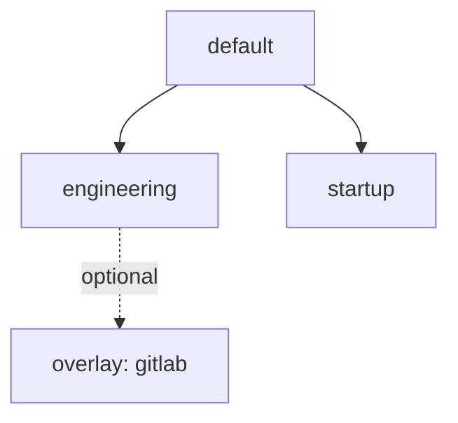

# Setup blueprint

Required steps before product work in any adopting repository.

## Flow



## Commands

```bash
# From a clone of this package:
scripts/agent doctor

# 1) Shared contract + memory only (no .cursor / .claude yet)
scripts/agent init --target /path/to/your-repo

# 2) Project harness into tool runtimes
scripts/agent install default --runtime all --target /path/to/your-repo

# Optional engineering + GitLab MR playbooks
scripts/agent install engineering --overlay gitlab --runtime all --target /path/to/your-repo

# Later: refresh managed files without clobbering local memory
scripts/agent sync --target /path/to/your-repo
```

## What each step writes

| Step | Writes | Does not write |
|---|---|---|
| `init` | `AGENTS.md`, `CLAUDE.md`, memory skeletons, `.agent-blueprint.yaml`, local override stub | `.cursor/`, `.claude/` |
| `install` | Selected blueprint into `--runtime` roots; refresh managed entrypoints | Existing memory file **content** |
| `sync` | Re-applies installed blueprint + runtimes (`preserve-local`) | Unmanaged / local overrides |

`--runtime`: `cursor` | `claude` | `all` (default).

## Blueprints



| Blueprint | Includes |
|---|---|
| `default` | `/start`, `/review`, safety + planning rules, core skills, memory templates |
| `engineering` | default + `/commit`, refactor skill, ADR/review templates |
| `startup` | default + PRD/ADR templates |

GitLab/`glab` MR commands are an **overlay**: `--overlay gitlab`.

## Checklist

Full adoption checklist: [adoption-and-lineage.md](adoption-and-lineage.md).
