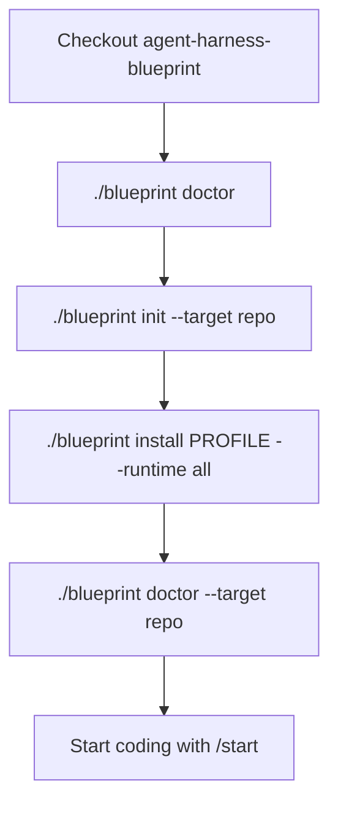
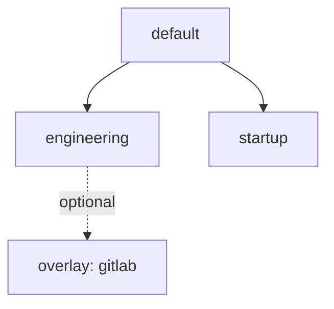

# Setup blueprint

Required steps before product work in any adopting repository.

## Flow



## Interactive menu

On a TTY, run with no command (or `menu`) for a guided UI:

```bash
./blueprint
# or
./blueprint menu --target /path/to/your-repo
```

Menu flow: set **target** first (any local path outside this package), then choose `init` / `install` (blueprint → overlay → runtime) / `sync` / `update` / `doctor`.

## Commands

```bash
# From a clone of this package:
./blueprint doctor

# 1) Shared contract + memory only (no .cursor / .claude yet)
./blueprint init --target /path/to/your-repo

# 2) Project harness into tool runtimes
./blueprint install default --runtime all --target /path/to/your-repo

# Optional engineering + GitLab MR playbooks
./blueprint install engineering --overlay gitlab --runtime all --target /path/to/your-repo

# Later: refresh managed files without clobbering local memory
./blueprint sync --target /path/to/your-repo
```

## What each step writes

| Step | Writes | Does not write |
|---|---|---|
| `init` | `AGENTS.md`, `CLAUDE.md`, memory skeletons, managed `.gitignore` section, `.agent-blueprint.yaml`, local override stub | `.cursor/`, `.claude/` |
| `install` | Selected blueprint into `--runtime` roots; refresh managed entrypoints | Existing memory file **content** |
| `sync` | Re-applies installed blueprint + runtimes (`preserve-local`) | Unmanaged / local overrides |

`--runtime`: `cursor` | `claude` | `all`. If omitted, `install` shows an interactive selector (Cursor and Claude are both optional). Non-interactive shells auto-pick from PATH or require `--runtime`.

## Blueprints



| Blueprint | Includes |
|---|---|
| `default` | `/start`, `/review`, safety + planning rules, core skills, memory templates |
| `engineering` | default + `/commit`, refactor skill, ADR/review templates |
| `startup` | default + PRD/ADR templates |

GitLab/`glab` MR commands are an **overlay**: `--overlay gitlab`.

## Checklist

Full adoption checklist: [adoption-and-lineage.md](adoption-and-lineage.md).
